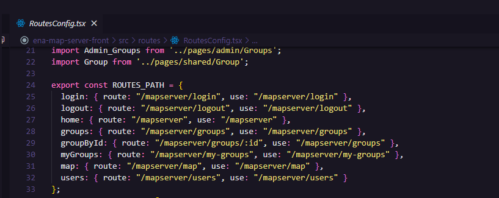
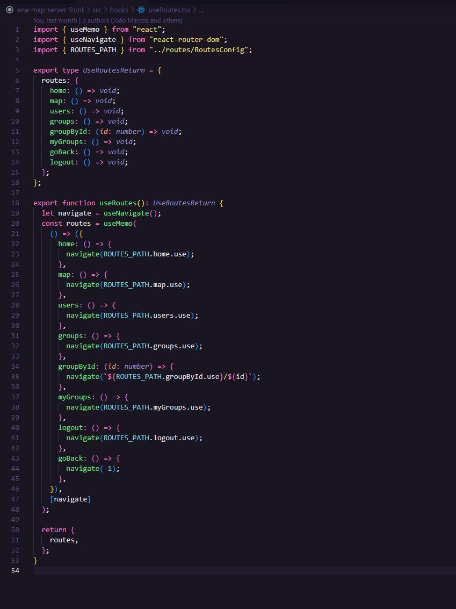
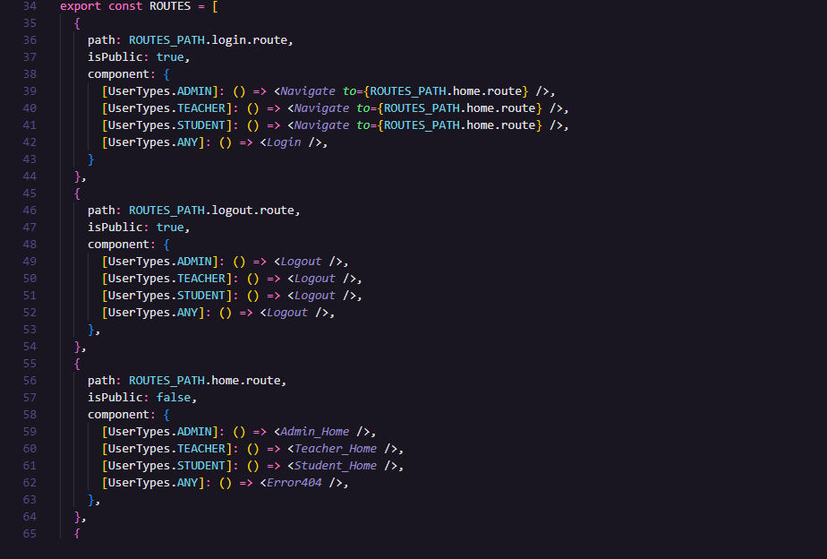

# ENA Map Server - Interface

Este é um projeto de um Sistema de Interface Front-End para o ENA Map Server, criado para fazer o Gerenciamento de Mapas no jogo ENA, utilizado no estudo de Orientação e Mobilidade.

## Tecnologias

Neste projeto, utilizamos as seguintes tecnologias:
* NodeJs + ReactJs + Typescript
* Material UI
* Styled Components (Criação de componentes com css)
* ContextAPI (estado global)
* Axios (Requisições via API REST)

# Como utilizar 

Para executar a aplicação localmente, será necessário:
* Ter o NodeJs já instalado na máquina
* Ter o projeto do ENA Map Server localmente, para executá-lo junto a interface 

Sabendo disso, temos os seguintes passos para utilizar o projeto:

### 1. Instalação dos pacotes

Abra o terminal no diretório raíz do projeto e execute o comando: ```npm install```

Ao concluir a instalação corretamente, vá para o próximo passo.

### 2. Execução do projeto

Para executar o projeto, utilize o comando: ```npm run start```. 

Ao executar este comando, a aplicação será executada. A mesma estará disponível para uso quando a URL do localhost for exibida no terminal, tal endereço web onde a aplicação poderá ser executada.

## Informações Adicionais

### Criação de Rotas

Para a criação de novas rotas e novas páginas, siga os passos dados abaixo:

1. Vá em "src/routes/RoutesConfig.tsx" e crie no objeto **ROUTES_PATH** um atributo contendo o nome da entidade como chave do atributo, e dentro dele, um objeto contendo os campos 'route' e 'use'.


2. Vá no arquivo "src/routes/useRoutes.tsx" e crie um método para retornar a rota desejada e crie sua assinatura no "UseRoutesReturn"


2. Volte no arquivo "src/routes/RoutesConfig.tsx" e crie na lista ROUTES um objeto contendo: o path da url, um campo dizendo se a rota é publica ou não, e seus componentes que serão renderizados de acordo com o tipo de cargo do usuário logado atualmente.


## Débitos Técnicos

Esta aplicação apresenta algumas questões técnicas que serão detalhadas a seguir:

### Navegação via leitores de tela

A navegação via leitores de tela é ideal nesta aplicação, devido ao seu propósito. Atualmente a interface possui alguns erros de escrita em HTML, e por conta disso, menus, botões e tabelas ficam inacessíveis ao navegar sem a utilização de um mouse, o que torna isto um grande débito técnico.

Espera-se que o usuário consiga navegar pelas telas completamente apenas utilizando o comando "Tab", tendo acesso a botões, menus, inputs de formuários, links, informações escritas em tabelas, entre outros elementos que serão importantes para a navegação essencial. Também seria ideal a execução de softwares de Leitura de Tela, como o JAWS (Job Access With Speech), para entender de fato sobre como a leitura de tela funciona diante destes apps.

### Refatoração na Estilização

Algumas correções deverão ser feitas na interface, como: remover estilizações desnecessárias e que estão causando bugs em posicionamento de componentes na tela, criar um container para trabalhar como limite minimo e máximo de píxels que a tela pode crescer, elaborar uma responsividade melhor nas páginas para poder obter uma qualidade melhor da interface em dispositivos de tela menores, deixando a navegação mais fluida.

### Transformar os formulários em páginas separadas

Na interface, atualmente, ao clicarmos para abrir algum formulário, o mesmo é aberto na mesma página em que o click ocorreu e um componente modal é aberto com o formulário por cima da página. Porém, além de não alcançar um aspecto ideal, também pode agravar o débito técnico de Navegação via leitores de tela, já que os componentes que estão sobrepostos pelo modal ainda estão renderizados via HTML, e poderão ser lidos, resultando em alguns problemas na navegação da tela.

Portanto, é recomendado que estes formulários sejam criados em telas separadas e em rotas distintas das demais, contendo apenas os dados do formulário à serem lidos.

### Adicionar ação ao expirar o Token

Quando o token de acesso do usuário é salvo no navegador e é feito a tentativa de entrar na interface após o token ter expirado, ocorre um problema em que o usuário consegue acessar as páginas privadas, porém todas as requisições feitas para a API não são aceitas, portanto a tela não produz nenhuma ação e permanece em estado de loading a cada vez que deve ser feito uma consulta ao servidor.

Para a resolução deste problema, é necessário tomar alguma ação quando o token expira, como por exemplo: aplicar uma lógica de refresh token para renovar o token do usuário atual sempre que este token expirar, ou redirecionar à página de login para o usuário se autenticar novamente e conseguir obter acesso as requisições da API.